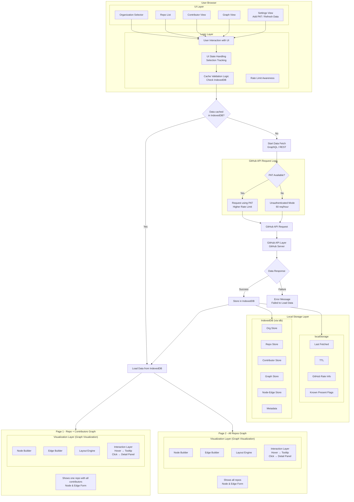

<!-- Don't delete it -->
<div name="readme-top"></div>

<!-- Organization Logo -->
<div align="center" style="display: flex; align-items: center; justify-content: center; gap: 16px;">
  
  
</div>

&nbsp;

<!-- Organization Name -->
<div align="center">

[](https://orgexplorer.aossie.org/)

</div>

<!-- Organization/Project Social Handles -->
<p align="center">
<a href="https://t.me/StabilityNexus">
</a>
&nbsp;&nbsp;
<a href="https://x.com/aossie_org">
</a>
&nbsp;&nbsp;
<a href="https://discord.gg/hjUhu33uAn">
</a>
&nbsp;&nbsp;
<a href="https://news.stability.nexus/">
  </a>
&nbsp;&nbsp;
<a href="https://www.linkedin.com/company/aossie/">
  </a>
&nbsp;&nbsp;
<a href="https://www.youtube.com/@StabilityNexus">
  </a>
</p>

---

<div align="center">
<h1>OrgExplorer</h1>
</div>

**OrgExplorer** is an open-source intelligence platform that transforms GitHub organizations into interactive, visual ecosystems.

Instead of browsing repositories one by one, OrgExplorer allows you to explore:

- Relationships between repositories  
- Contributor collaboration networks  
- Activity trends over time  
- Bus factor risks  
- Language distribution  
- Organizational health metrics  

It turns GitHub data into insight.

---

## 🚀 Features

  **Fully Browser-Based Application**
   No backend server required. Runs entirely in the browser using GitHub's REST API for data retrieval and processing. Runs entirely in the browser with no dedicated backend server. All data is fetched directly from GitHub APIs.

- **Organization Intelligence Dashboard**  
  Overview of total repositories, stars, contributors, creation timeline, tech stack distribution, and activity insights.

- **Repository Analytics**  
  Deep dive into repository health, commit frequency, contributor density, issue trends, and language composition.

- **Contributor Network Visualization**  
  Graph-based view of how contributors collaborate across repositories.

- **Bus Factor & Risk Insights**  
  Identify single points of failure and contributor concentration risks.

- **Activity & Growth Trends**  
  Track repository creation patterns, commit waves, and engagement over time.

- **REST-first Data Strategy**  
  Uses GitHub REST API for initial trust-building insights before enabling advanced authenticated GraphQL exploration.

  **Optional Authenticated Mode**
   For users who want deeper insights, an authenticated mode can be enabled to access GitHub's GraphQL API, unlocking more detailed data and analytics.

---

## 💻 Tech Stack

### Frontend

- TypeScript
- TailwindCSS
- Framer Motion (animations)
- D3.js / Graph-based visualizations
- GitHub REST API
- Optional GraphQL API (Authenticated Mode)

---

## ✅ Project Checklist

- [x] Organization overview dashboard implemented  
- [x] Repository-level analytics implemented  
- [x] Contributor graph visualization system built  
- [x] Advanced GraphQL authenticated mode  
- [x] Enterprise-grade caching and rate optimization  
- [x] Historical data tracking engine  

---

## 🔗 Repository Links

1. [Main Repository](https://github.com/AOSSIE-Org/OrgExplorer)

---

## 🏗️ Architecture Diagram



### System Structure

- Frontend (React + D3.js)
- Data Processing Layer (analytics engine)
- GitHub REST API
- Optional GitHub GraphQL API
- Database (IndexedDB for caching, local storage for user settings)
- UI Rendering Layer (dashboard, graphs, panels)

Data flows:

User → Frontend → API → GitHub APIs → Processing Layer → Database → UI Rendering

---

## 🔄 User Flow

```
User enters organization name
        ↓
REST API fetches public insights
        ↓
Analytics engine computes metrics
        ↓
Dashboard renders visual intelligence
        ↓
(Optional) User enables advanced authenticated mode
```

### Key User Journeys

1. **Explore an Organization**
   - Enter org name
   - View overview dashboard
   - Analyze repository metrics

2. **Analyze Contributor Network**
   - Open contributor graph
   - Inspect collaboration edges
   - Identify central contributors

3. **Risk Assessment**
   - Open bus factor panel
   - Detect low contributor redundancy
   - Review critical repositories

---

## 🍀 Getting Started

### Prerequisites

- Node.js 18+
- npm / pnpm / yarn
- GitHub API rate awareness

---

### Installation

#### 1. Clone the Repository

```bash
git clone https://github.com/AOSSIE-Org/OrgExplorer.git
cd OrgExplorer
```

#### 2. Install Dependencies

```bash
npm install
```

#### 3. Run Development Server

```bash
npm run dev
```

#### 4. Open Browser

Navigate to:

http://localhost:3000

---


## 🙌 Contributing

We welcome developers, designers, data scientists, and open-source enthusiasts.

Ways you can contribute:

- Improve analytics algorithms
- Enhance UI/UX
- Optimize API rate handling
- Add new visualizations
- Improve documentation
- Fix bugs & performance issues

Before contributing:

1. Fork the repository
2. Create a feature branch
3. Follow coding standards
4. Submit a pull request with clear description

Please read our [Contribution Guidelines](./CONTRIBUTING.md).

If you love the vision — give it a ⭐.

---

## ✨ Maintainers

- AOSSIE Core Team

---

## 📍 License

This project is licensed under the GNU General Public License v3.0.  
See the [LICENSE](LICENSE) file for details.

---

## 💪 Thanks To All Contributors

Open source grows because of people like you.

© 2026 AOSSIE. All rights reserved.